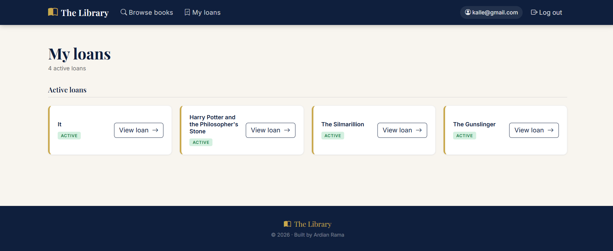
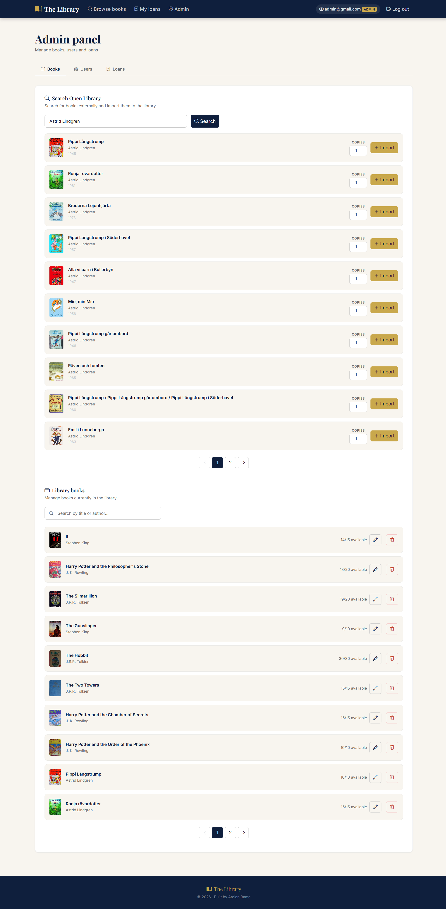

# Library Frontend


A modern, responsive frontend for the [Library Management System](https://github.com/ardianRama/library-management-system) — a digital library built with Java 21 and Spring Boot.

The application supports two roles:

- **Admin** — full control over books, users and loans
- **User** — can browse, borrow and manage their own loans

---

## 📸 Screenshots

### Home
<a href="screenshots/home.png">
  
</a>

### Browse Books
<a href="screenshots/browse-books.png">
  
</a>

### My Loans
<a href="screenshots/my-loans.png">
  
</a>

### Admin Panel
<a href="screenshots/admin.png">
  
</a>

---

## ✨ Features

### User
- Register a new account with form validation
- Log in with JWT-based authentication
- Browse and search books available in the library
- Borrow books and view active loans
- Return books

### Admin
- Search for books via the Open Library API and import them
- Manage library books (update copies, delete)
- Manage users (add, delete, search)
- View all loans with filtering and search

---

## 🛠️ Tech Stack

| Layer      | Technology                  |
| ---------- | --------------------------- |
| Framework  | React 19                    |
| Bundler    | Vite                        |
| Styling    | Bootstrap 5 + custom CSS    |
| Routing    | React Router DOM            |
| Forms      | React Hook Form + Zod       |
| HTTP       | Axios                       |
| Auth       | JWT                         |

---

## 🚀 Getting Started

### Prerequisites

Make sure you have installed:

- [Node.js](https://nodejs.org/) (v18 or later)
- The [Library Management System](https://github.com/ardianRama/library-management-system) backend running on port `8080`

### 1. Clone the repository

```bash
git clone https://github.com/ardianRama/library-frontend.git
cd library-frontend
```

### 2. Install dependencies

```bash
npm install
```

### 3. Start the development server

```bash
npm run dev
```

The app will be available at `http://localhost:3000`.

> **💡 Tip:** The frontend proxies all `/api` requests to `http://localhost:8080`. Make sure the backend is running before starting the frontend.

---

## 🔐 Authentication

The app uses JWT-based authentication. The token is stored in `localStorage` and sent as a `Bearer` token in the `Authorization` header on every API request.

Protected routes redirect unauthenticated users to `/login`. The `/admin` route is restricted to users with the `ROLE_ADMIN` role.

---

## 📁 Project Structure

```
src/
├── components/
│   ├── admin/          # Admin-specific components
│   ├── Footer.jsx
│   ├── LoanModal.jsx
│   ├── Navbar.jsx
│   ├── ProtectedRoute.jsx
│   └── Toast.jsx
├── context/
│   └── AuthContext.jsx
├── pages/
│   ├── AdminPage.jsx
│   ├── AuthPages.jsx
│   ├── BooksPage.jsx
│   ├── HomePage.jsx
│   └── LoansPage.jsx
└── services/
    ├── authService.js
    ├── bookService.js
    ├── loanService.js
    └── userService.js
```

---

## 🔗 Related

- [Library Management System (Backend)](https://github.com/ardianRama/library-management-system)

---

## License

MIT © Ardian Rama
